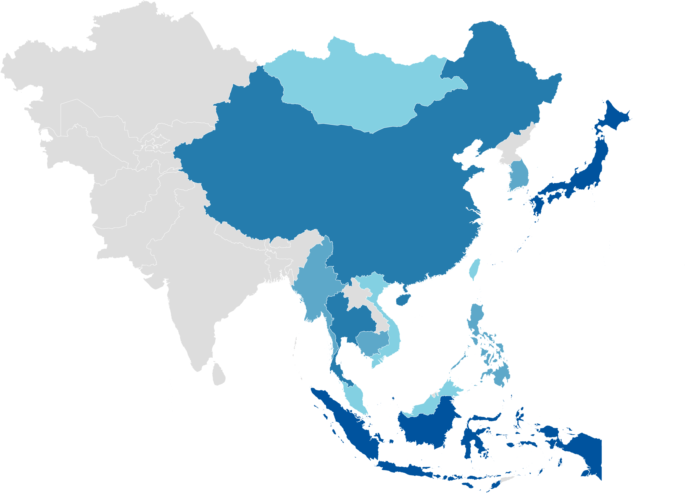

## Bachelor Thesis : "Le opinioni dei cittadini del Sud-Est Asiatico sull'influenza cinese e americana"

 

  
  
  

  

  

## Abstract

Questo lavoro ha come obiettivo quello di analizzare la percezione dei cittadini
del Sud-Est Asiatico nei confronti della Cina e degli Stati Uniti d’America. In
particolare, la domanda alla quale si vuole provare a rispondere è la seguente:
al variare dell’accesso ad internet dei rispondenti e controllando per determinate
caratteristiche come il Paese di residenza, come varia il punto di vista di quest’ultimi
riguardo le due Superpotenze citate?

Il questionario dal quale sono presi i dati usati nell’elaborato è l’Asian Barometer
Survey (ABS), in particolare, la quarta edizione (W4), risalente al periodo 2014-2016.
Questo sondaggio è particolarmente importante per studiare fenomeni socio-politici
in Asia, in quanto è uno dei pochi, se non l’unico, in grado di riuscire a coinvolgere
più paesi di quel continente, permettendo così ai ricercatori di svolgere confronti tra
questi ; cosa non da poco osservando le ampie differenze socio-politiche tra stati e la solo recente permeazione della statistica in questo vasto territorio.

Il tema scelto, che potrebbe apparire insolito agli occhi occidentali, si basa su
importanti radici di carattere geopolitico ed economico. La Cina affonda le proprie
radici in una civiltà millenaria, il cui nucleo fondante deriva territorialmente dall’unificazione di sette regni a partire già dal III secolo A.C. sotto il primo imperatore
cinese. Nel corso della storia si è contraddistinta per un profondo senso di orgoglio e
consapevolezza accompagnate dalla difesa della propria identità culturale, maturando una volontà di isolazionismo nel tramandare e custodire gelosamente la propria
struttura e tradizioni.

Con il passare dei secoli il potere del Celeste Impero man mano venne meno. Il
paese fu sempre più oggetto delle mire di colonialismo prima ed imperialismo poi, del
mondo occidentale. D’altra parte, gli imperatori Cinesi, vivendo nella Città Proibita
a Pechino, avevano perso il contatto con la realtà degli arretrati territori su cui
regnavano; invece di imbastire relazioni con le nuove controparti, si isolarono ancora
di più, aumentando la loro ostilità nei confronti degli stranieri giorno dopo giorno.
Tremende le conseguenze delle sconfitte nelle Guerre dell’Oppio nel 1842 e nel 1860
con la Gran Bretagna, che conclamò la fase crepuscolare imperiale Cinese, sia dal
punto di vista economico, sia da quello morale e cultuale: la fierezza e grandezza
dell’identità cinese era stata irrimediabilmente lesa. La rivolta di Wuchang nel 1911
portò alla proclamazione di indipendenza e della Repubblica di Cina, ponendo fine
all’Impero, aprendo le porte al periodo più cruento della storia della Cina moderna:
si susseguirono il periodo dei Signori della Guerra, l’invasione da parte dei giapponesi
e la sanguinosa guerra civile tra Mao Zedong e Chiang Kai-shek, terminata nel 1949
con la sconfitta di quest’ultimo ed il suo successivo ritiro a Taiwan proclamando
la Repubblica Popolare Cinese. Il partito comunista cinese da allora cominciò un
mirato processo di indottrinamento politico suscitando un profondo desiderio di
rivalsa nei confronti degli occidentali ed i giapponesi rei di aver umiliato la Cina con
le loro occupazioni.

Attualmente la Cina è destinata ad assumere il ruolo di prima potenza economica
mondiale, a discapito degli USA, basti pensare che, nonostante i mostruosi danni
globali della pandemia di COVID-19, quella di Pechino è stata l’unica economia al
mondo ad essere cresciuta in questo turbolento anno. E’ bene però riportare che
sul piano militare e strategico sono ancora indietro di decenni rispetto l’America.
L’occulta censura da parte del partito comunista e la mancanza di diritti umani,
sono soltanto due esempi dei disparati problemi interni che il paese presenta, seguiti
dal contraddittorio dato che incorona la Cina il secondo PIL mondiale, ma solamente
settantaduesima per Reddito Pro Capite. Dunque, nonostante sia formalmente una
repubblica socialista guidata da un unico partito, molti esperti la ritengono di fatto
una dittatura.

Gli Stati Uniti d’America, al contrario, non hanno bisogno di presentazioni;
interpretano da quasi ottant’anni il ruolo di stato più importante del mondo e
naturalmente hanno l’obbiettivo di mantenerlo. Ovviamente per non essere spodestati, il loro piano deve essere quello di limitare l’espansione cinese ed al contempo continuare la propria.

Pertanto il ventunesimo secolo vedrà lo scontro tra queste
due superpotenze e nonostante in molti diano per certo il trionfo di Pechino, solo il
tempo saprà dire la verità.
E’ molto interessante, dunque, conoscere l’opinione degli asiatici a riguardo; chi
dei due sfidanti riuscirà a conquistare politicamente l’Asia probabilmente avrà anche
la meglio sull’altro.

